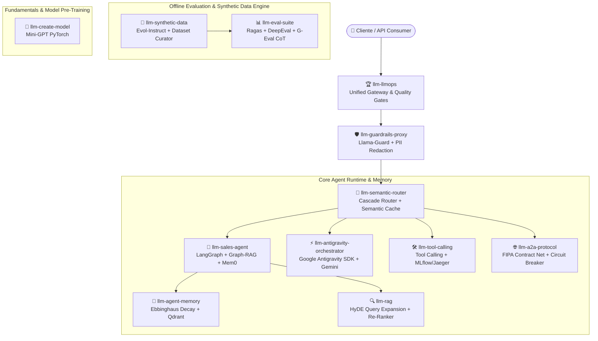

<div align="center">

# Cayo Eduardo
### **AI Engineer | Machine Learning & LLMOps Specialist**

[](https://github.com/CayoEsn)
[](https://linkedin.com/in/cayoeduardo)
[](mailto:cayoesn@gmail.com)

</div>

---

## 🎯 Foco Profissional & Objetivo do Portfólio

Sou engenheiro focado no desenvolvimento de sistemas inteligentes, especializado na interseção entre **Large Language Models (LLMs)**, **Machine Learning (ML)** e **LLMOps**. 

Este portfólio foi projetado como um ecossistema de estudo aprofundado e demonstração prática de engenharia, cobrindo o ciclo de vida completo de aplicações baseadas em IA generativa. Todos os **12 projetos** deste repositório exploram e validam pilares fundamentais da área — desde a orquestração de agentes autônomos e sistemas de memória cognitiva até arquiteturas RAG de alta precisão, guardrails de segurança, roteamento semântico, geração sintética de dados, avaliação continuada e treinamento de modelos do zero.

---

## 🏛️ Ecossistema Completo de Microserviços de IA



---

## 💎 Repositórios & Arquiteturas de Destaque (12 Repositórios)

### 🤖 1. Agentes Autônomos, Ferramentas & Orquestração Multi-Agente

#### [**`llm-sales-agent`**](https://github.com/cayoesn/llm-sales-agent)
- **Desafio de Engenharia:** Agentes de vendas tradicionais perdem contexto em conversas longas e tomam decisões imprevisíveis.
- **Solução & Algoritmo:** Grafo de Conhecimento (**Graph-RAG**), memória de longo prazo (**Mem0**), Máquina de Estados Finitos (**FSM de Negociação**) e saídas estruturadas estritas (**Pydantic**).
- **Stack Tecnológica:** `Python` `LangGraph` `Mem0` `Qdrant` `FastAPI` `Docker`

#### [**`llm-antigravity-orchestrator`**](https://github.com/cayoesn/llm-antigravity-orchestrator)
- **Desafio de Engenharia:** Necessidade de orquestrar fluxos multi-agente complexos com controle rigoroso de ciclo de vida e auditoria de consumo de tokens.
- **Solução & Algoritmo:** Orquestrador auto-gerenciado construído sobre o **Google Antigravity (AGY) SDK**, estendendo hooks assíncronos de ciclo de vida e auditoria fina do Gemini AI.
- **Stack Tecnológica:** `Python` `Google Antigravity SDK` `Gemini AI` `FastAPI` `Docker`

#### [**`llm-a2a-protocol`**](https://github.com/cayoesn/llm-a2a-protocol)
- **Desafio de Engenharia:** Falta de padronização e resiliência na comunicação e alocação de tarefas entre múltiplos agentes independentes.
- **Solução & Algoritmo:** Protocolo de leilão distribuído **FIPA Contract Net**, **Circuit Breaker** (estados CLOSED/OPEN/HALF_OPEN), Dead Letter Queue (DLQ) e **W3C CloudEvents**.
- **Stack Tecnológica:** `Python` `FIPA ACL` `Circuit Breaker` `Redis` `FastAPI` `Docker`

#### [**`llm-tool-calling`**](https://github.com/cayoesn/llm-tool-calling)
- **Desafio de Engenharia:** Garantir execução segura e rastreável quando agentes acionam ferramentas e APIs externas.
- **Solução & Algoritmo:** Runtime de chamada de ferramentas com planejamento estruturado JSON, validação de argumentos e observabilidade profunda via **MLflow** e **Jaeger**.
- **Stack Tecnológica:** `Python` `Tool Calling` `MLflow` `Jaeger` `FastAPI` `Docker`

---

### 🔍 2. RAG Avançado, Memória Cognitiva & Roteamento

#### [**`llm-rag`**](https://github.com/cayoesn/llm-rag)
- **Desafio de Engenharia:** RAGs ingênuos (Naive RAG) sofrem com baixo recall em buscas complexas e estouro de contexto.
- **Solução & Algoritmo:** **HyDE (Hypothetical Document Embeddings)** para expansão de queries, **Contextual Re-Ranker Engine** e ingestão assíncrona indexada no **Qdrant**.
- **Stack Tecnológica:** `Python` `HyDE` `Qdrant` `MLflow` `FastAPI` `Docker`

#### [**`llm-agent-memory`**](https://github.com/cayoesn/llm-agent-memory)
- **Desafio de Engenharia:** Acúmulo desordenado de histórico conversacional que sobrecarrega a janela de contexto dos modelos.
- **Solução & Algoritmo:** **Ebbinghaus Forgetting Curve Engine** ($R = e^{-t / S}$) para cálculo de retenção e decaimento temporal, reforço por acesso e consolidação automática de memórias.
- **Stack Tecnológica:** `Python` `Ebbinghaus` `Qdrant` `Redis` `FastAPI` `Docker`

#### [**`llm-semantic-router`**](https://github.com/cayoesn/llm-semantic-router)
- **Desafio de Engenharia:** Custo elevado e alta latência ao enviar todas as consultas para LLMs de grande porte.
- **Solução & Algoritmo:** **Cost-Aware Cascade Model Selector** (SLM Nano 3B vs LLM Frontier 70B/GPT-4o) baseado em complexidade e **Semantic Cache** (<5ms).
- **Stack Tecnológica:** `Python` `Semantic Cache` `Cascade Router` `FastAPI` `Docker`

---

### 🛡️ 3. Segurança, Moderação & Gateway Industrial (LLMOps)

#### [**`llm-llmops`**](https://github.com/cayoesn/llm-llmops)
- **Desafio de Engenharia:** Falta de padronização no ciclo de vida de LLMs, dificultando governança, rastreabilidade e controle de produção.
- **Solução & Algoritmo:** Arquitetura de Referência Industrial unificando API Gateway, Cache Semântico, Guardrails, Quality Gates CI/CD e Observabilidade Centralizada no **Langfuse**.
- **Stack Tecnológica:** `Python` `Langfuse` `Semantic Cache` `CI/CD` `FastAPI` `Docker`

#### [**`llm-guardrails-proxy`**](https://github.com/cayoesn/llm-guardrails-proxy)
- **Desafio de Engenharia:** Risco de vazamento de dados sensíveis (PII), prompt injection e saídas desalinhadas com éticas corporativas.
- **Solução & Algoritmo:** **Llama-Guard Safety Classifier** sob taxonomia de 6 categorias de risco, **PII Sanitizer Engine** (CPF, Email, Cartão) e interceptador de Jailbreak.
- **Stack Tecnológica:** `Python` `Llama-Guard` `PII Sanitizer` `FastAPI` `Docker`

---

### 📊 4. Avaliação Offline, Dados Sintéticos & Fundamentos de IA

#### [**`llm-eval-suite`**](https://github.com/cayoesn/llm-eval-suite)
- **Desafio de Engenharia:** Dificuldade de mensurar quantitativamente a qualidade de respostas e regressões em pipelines de LLM.
- **Solução & Algoritmo:** **Ragas & DeepEval Metrics Engine** (*Faithfulness*, *Relevancy*, *Recall*), **G-Eval LLM-as-a-Judge CoT** e gerador sintético de Golden Datasets.
- **Stack Tecnológica:** `Python` `Ragas` `DeepEval` `G-Eval` `FastAPI` `Docker`

#### [**`llm-synthetic-data`**](https://github.com/cayoesn/llm-synthetic-data)
- **Desafio de Engenharia:** Escassez de dados de instrução de alta qualidade para fine-tuning de modelos proprietários.
- **Solução & Algoritmo:** **Dataset Curator & Quality Filtering Engine** com desduplicação por similaridade Jaccard/MinHash e gerador **Evol-Instruct**.
- **Stack Tecnológica:** `Python` `Dataset Curator` `Evol-Instruct` `QLoRA` `Docker`

#### [**`llm-create-model`**](https://github.com/cayoesn/llm-create-model)
- **Desafio de Engenharia:** Compreender o funcionamento interno das arquiteturas de Transformers sem depender apenas de APIs prontas.
- **Solução & Algoritmo:** Implementação educacional de um **Transformer (decoder-only / Mini-GPT)** treinado do zero em PyTorch com rastreamento via MLflow.
- **Stack Tecnológica:** `PyTorch` `Transformers` `MLflow` `Python`

---

## 🛠️ Stack Tecnológica

```
🧠 AI & Agentic Frameworks : LangGraph, LangChain, Graph-RAG, Mem0, Google Antigravity SDK, Ollama, PyTorch
🔍 Search & Vector DBs     : Qdrant, PostgreSQL (pgvector), Redis, HyDE, BM25 / Sparse Encoders
🛡️ Guardrails & Safety    : Llama-Guard, NeMo Guardrails, PII Redaction, Anti-Prompt Injection
📊 LLMOps & Observability  : Langfuse, OpenTelemetry, MLflow, Prometheus, Grafana, Jaeger
⚙️ Runtime & Infrastructure: Python 3.12, FastAPI, Docker, Docker Compose, CI/CD Quality Gates
```
